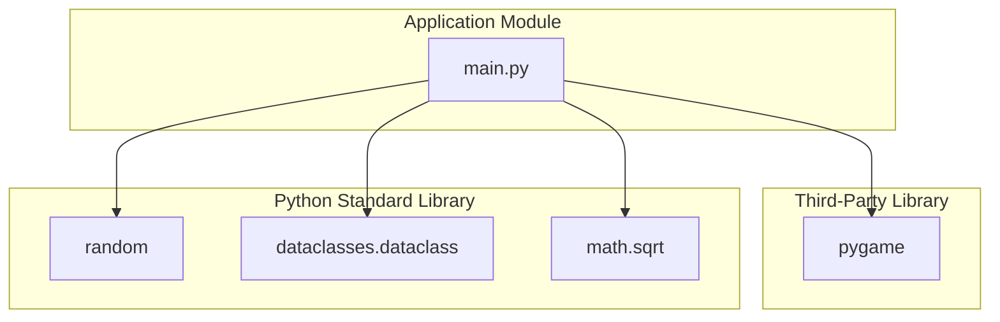
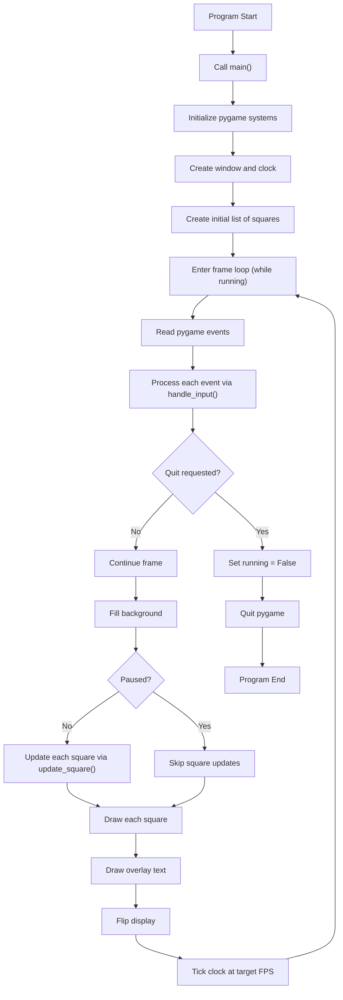
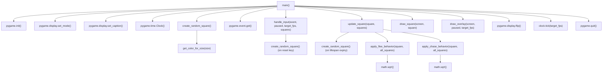
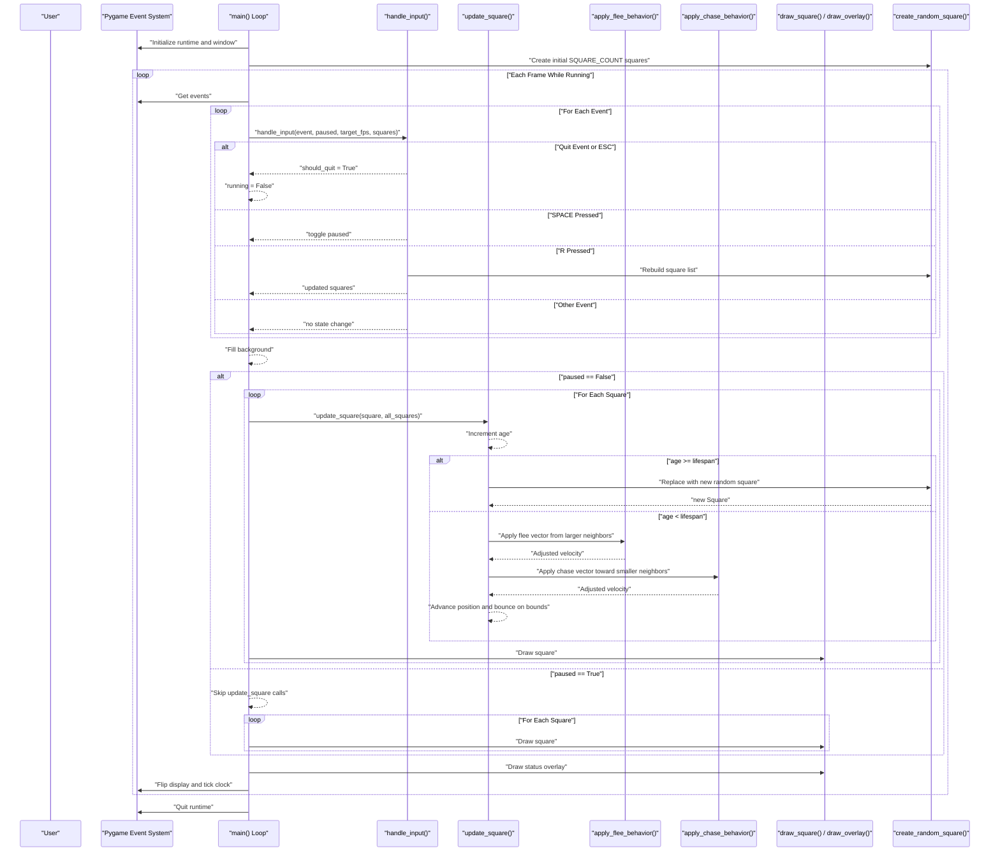

# Project Architecture

This document describes the executable architecture of this project based on `main.py`.

## 1) Module Dependency Graph

Notes:
- The codebase currently has one executable Python module (`main.py`).
- All runtime behavior is orchestrated from `main()`.

## 2) High-Level Runtime Flow Graph

## 3) Function-Level Call Graph

## 4) Primary Execution Sequence Diagram

## Architecture Notes

- The architecture is intentionally centralized: one module controls initialization, event handling, simulation updates, and rendering.
- Simulation state is mutable and frame-based, with in-place square updates except when lifespan expiry triggers object replacement.
- Behavior composition inside `update_square()` combines local movement, flee response, chase response, and boundary constraints in a deterministic order.

## Assumptions

- The documented primary path assumes normal execution from `python main.py` with no runtime import errors.
- `find_nearest()` exists in code but is currently not called by the active execution path.
